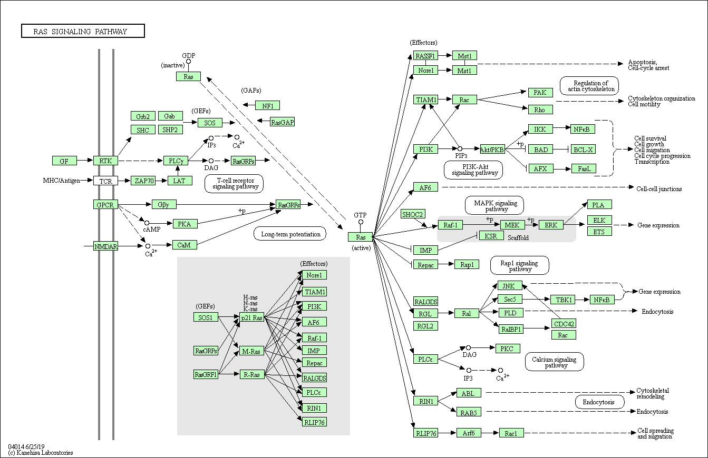

# RasVis: Redesigning Pathways to Support Analyses of Experimental Data 

## Motivation for Redesign
Static biological pathway diagrams represent biochemical relationships between particular biomolecular elements within a cell. Our cancer biology collaborators research noncoding RNA "dark matter" in pluripotent stem cells and cancer, informing RNA-based precision medicine approaches to detect and treat cancer early on. We worked closely with them to develop new pathway representations to make it easier to investigate how mutations in the RAS protein family affect noncoding RNAs and to visualize causal relationships between transcription events and interferon simulated genes, which may provide deeper insight in to the mechanics of RAS-related cancers.

Existing tools are not well-suited to focus only on specific elements of interest within a pathway or to find connections between elements across multiple pathways. Automated pathway generation tools can produce diagrams that may introduce visual clutter, while manually curated pathways (e.g., available from KEGG or Reactome) often include details that are irrelevant to a particular analysis or empirical investigation (as in Figs. 1 and 2).

*Figure 1: Ras Signaling Pathway*

*Figure 2: lncRNAs involved in the IFN antiviral response.*

## Redesign Results

*Figure 3*

*Figure 4*

Here are two examples of redesigned pathways using the current version of RasVis to show relationships between protein concentrations and transcription events.
1. Most non-essential elements of the RAS, MAPK/ERK, and IFN pathways are removed. Other elements are drawn in gray to provide contextual clues to situate the diagram in terms of well-known proteins, but at same time indicate that they are not as relevant to this particular analysis of the pathway, allowing the researcher to focus on the significant elements.
2. Rounded, rectangular nodes and smooth, curved paths make a more readable pathway, and more clearly emphasize the relationship between proteins and transcription events identified in experimental data.
The *log2FoldChange* metric is encoded both with the opacity of the node as well as the weight of the connecting line, where both the darkness of a node and the thickness of an arc indicates an increased concentration of a protein or noncoding RNA.
4. Elements associated with transcription events are indicated by the blue bar on the right side of the node. In Figure 3, elements affected by higher concentrations of the ELK1 protein are organized into two columns based on whether or not they trigger a transcription event.

## Design Considerations

Figure 5: We created a design specification sheet to explore a range of options for styling pathway features, including: node shape, fixed-width vs. varied-width nodes, different link color pairings, and variations in the positioning of inputs and outputs. We explored different combinations of straight vs. curved joints, top-weighted vs. center-weighted inputs, and space-separated links vs. unseparated links for nodes with many connections.

Figure 6: Here, the straight paths turn out to be more difficult to follow and interpret. Additionally, the top-weighted pathway unintentionally indicates a hierarchy between proteins.

Figure 7: In this iteration, separating the noncoding RNA into a left and right column saves space, but implies that there is a meaning to the placement of genes in each column.

Figure 8: Here, as in Figure 7, the bulkier line weights dominate the visualization. Our cancer biology collaborators were concerned that the overly thick lines make it harder to interpret structural elements in the pathway.

## Future Work
We are currently working on extending RasVis to automate the layout of custom pathway representations, to incorporate additional metrics, to provide alternative mappings between metrics and visual encodings, to make it easier for researchers to filter and merge pathways, and to further customize pathways by overlaying experimental data and highlighting pathway and transcription event dynamics. We also plan to include interactive animations that emphasize changes in experimental data across multiple time steps. The initial site is live here: https://creativecodinglab.github.io/RasVis/

## Acknowledgement
We thank Daniel Kim, Roman Reggiardo, and Haley Halasz of the [Daniel Kim Lab](https://dkim.sites.ucsc.edu/) at UC Santa Cruz.

## References
* Kim, Daniel H., et al. “Single-cell transcriptome analysis reveals dynamic changes in lncRNA expression during reprogramming.” Cell Stem Cell 16.1 (2015): 88-101.
* Murray, Paul., et al. "A taxonomy of visualization tasks for the analysis of biological pathway data." BMC Bioinformatics 18.2 (2017): 21.
* Qiu, Lipeng, et al. "Long non-coding RNAs: Regulators of viral infection and the interferon antiviral response." Frontiers in Microbiology 9 (2018): 1621.

## Authors and Contact Information
Cassia Artanegara, Angus G. Forbes
Department of Computational Media, UC Santa Cruz
{cassia, angus}@ucsc.edu
